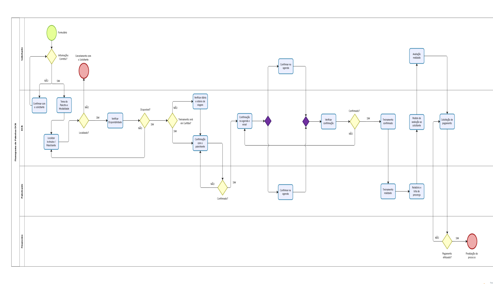
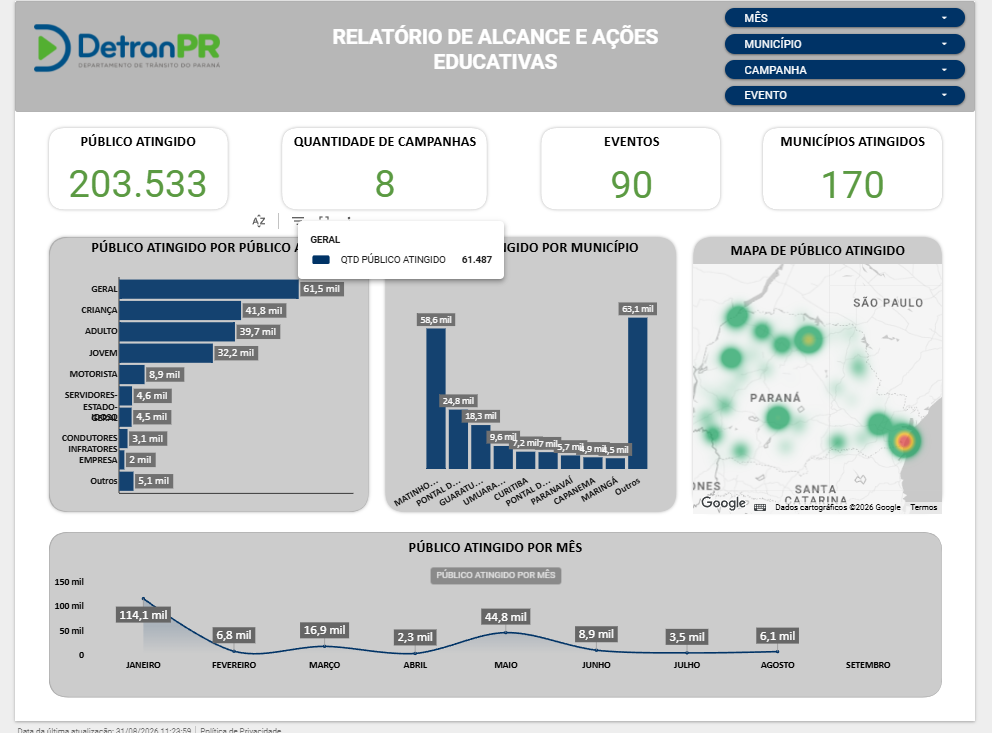
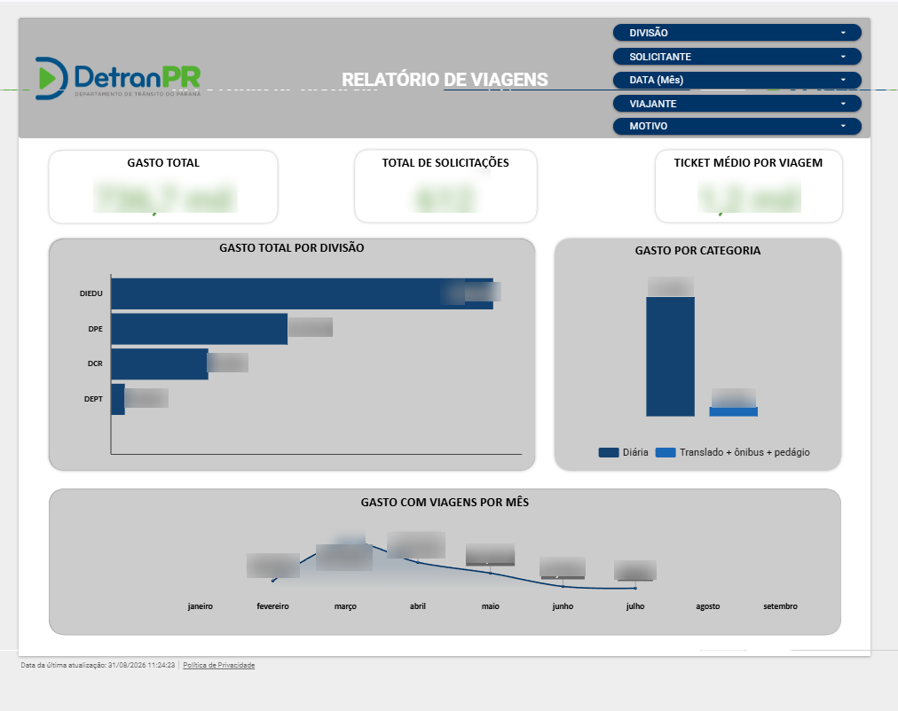
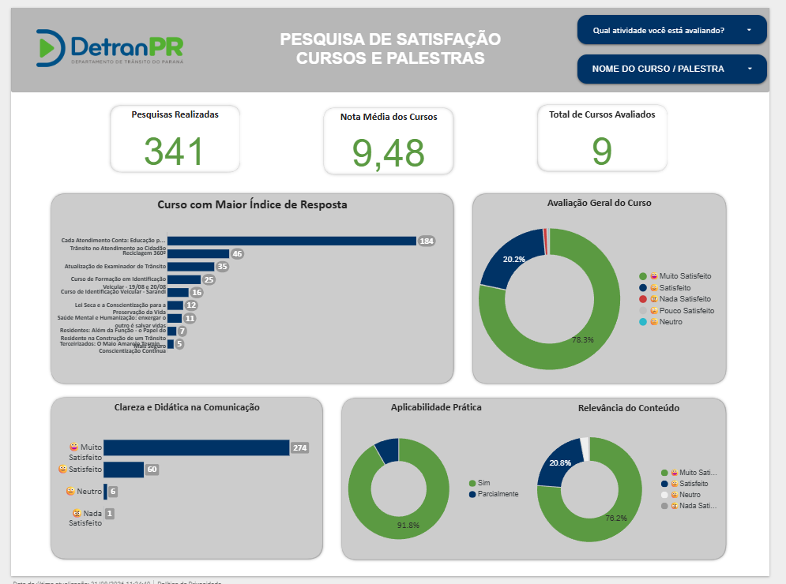

# Automação e Dados no DETRAN-PR

Case study do estágio como Analista de Dados (Automações) na Diretoria de Educação de Trânsito do DETRAN-PR, desde maio de 2026. Documenta metodologia e resultado, sem código institucional nem dados reais.

## Contexto

Fui nomeado pela Diretora de Educação de Trânsito como responsável técnico pelos estagiários do setor. Na prática isso envolve três frentes:

**Supervisão de equipe.** Analiso e direciono o trabalho de 3 estagiários, distribuindo demandas e acompanhando a execução.

**Treinamento.** Criei a trilha de entrada para novos estagiários, descrita mais abaixo, para que a equipe não dependa de repasse informal a cada troca de pessoa.

**Conferência técnica.** Sou responsável por validar se as informações entregues estão corretas e bem apresentadas, atuando como QA das entregas do setor.

O que mudou no setor: o trabalho passou a ser bem mais tecnológico. Entraram boas práticas de desenvolvimento, automações no lugar de preenchimento manual, decisão baseada em dashboard em vez de planilha solta, e sistemas de gerenciamento para acompanhar demanda.

## Antes de automatizar

Nenhuma rotina começou pelo código. Cada uma começou entendendo o processo com quem executa: o que o servidor faz hoje, por que faz nessa ordem, onde trava e o que já deu errado antes. Só depois disso o fluxo virou modelo BPMN e, quando fazia sentido, virou automação.

Boa parte do que parece problema técnico é decisão de processo que nunca foi registrada em lugar nenhum. Automatizar antes de entender isso só acelera o erro.

## Automações

### Solicitação de viagens

Antes, o cadastro de viagem de cidadão no sistema legado era feito à mão, um por um, e levava um dia inteiro de trabalho.

A automação lê a planilha gerada por um formulário, percorre a lista e cadastra cada viagem no sistema, capturando log de sucesso ou de erro em cada tentativa. Quem falha fica registrado com o motivo, então a revisão humana é pontual, não recomeça do zero.

Stack: Python, Selenium, Pandas, gspread.

**Resultado: de 1 dia inteiro para menos de 20 minutos.** Roda cerca de 3 vezes por mês.

### Inscrição em cursos institucionais

Antes, a inscrição era feita aluno por aluno, cerca de 3 horas por turma.

A automação funciona em 3 blocos:

1. **Inserção dos já cadastrados.** Percorre a lista de CPFs. Quem já existe no sistema é inserido direto na turma. Quem não existe vai para uma lista de pendência.
2. **Cadastro dos pendentes.** Cadastra cada pendente e grava numa coluna de controle se deu certo ou qual foi o erro.
3. **Inserção dos recém-cadastrados.** Volta na lista, filtra só quem foi cadastrado com sucesso no bloco 2 e insere na turma, atualizando o status de novo.

O controle de qualidade está embutido: cada bloco grava o motivo específico da falha. Isso separa erro de dado enviado errado pelo servidor de divergência no cadastro do condutor, que exigem tratamento diferente.

Stack: Python, Selenium, Pandas, gspread.

**Resultado: de cerca de 3 horas para 3 minutos.** Roda cerca de 4 vezes por mês.

### Impacto somado

Considerando a frequência das duas rotinas, a automação devolve cerca de **34 horas por mês ao setor, algo perto de 400 horas por ano**. São horas que antes iam para digitação e conferência manual e hoje vão para análise e atendimento.

### Por que Selenium

Os sistemas envolvidos são legados, sem API ou integração disponível. Automatizar pela interface foi a única via possível, então o esforço foi direcionado para tornar isso confiável: log de erro por registro, status gravado em planilha e ponto de retomada, em vez de um script que roda tudo ou falha tudo.

## Google Apps Script

Duas soluções construídas dentro do próprio Workspace, onde o usuário final já trabalha:

**Preenchimento guiado de planilha.** Um menu próprio na planilha abre um formulário de preenchimento, em vez de o servidor digitar direto nas células. Resolve o problema real de planilha compartilhada: usuário sobrescrever fórmula, quebrar formato ou preencher campo no lugar errado. O dado entra validado e a estrutura da planilha permanece intacta.

**Certificado e card automáticos.** Projeto pedido pela diretoria: a partir de uma inscrição no Forms, o script gera e envia por e-mail o certificado e um card personalizado, com o número de adesão do participante. O e-mail chega cerca de 20 segundos depois da resposta, sem nenhuma etapa manual no meio.

## Trilha de onboarding técnico

Antes, cada estagiário novo aprendia por repasse informal, o que fazia o conhecimento sair junto com quem ia embora. Estruturei uma trilha de entrada em automação e processos, montada no Moodle e concluída em 2 a 4 semanas, com 6 módulos mais um projeto final:

| Módulo | Conteúdo |
|---|---|
| Processos e governança | BPMN, Bizagi, Git e GitHub |
| Fundamentos de IA e produtividade | LLM, prompt, IA como copiloto |
| Ambiente e programação base | Python, venv, `.env`, tratamento de erro, manipulação de arquivo |
| Camada de dados | Pandas com Excel e Google Sheets via gspread |
| Engenharia de automação (RPA) | Selenium, praticado em sistema local simulado |
| Monitoramento e sustentação | Logging e Looker Studio |
| Projeto final | Robô que lê planilha e popula formulário |

Duas decisões da trilha valem destaque. A prática de Selenium acontece em **sistema local simulado**, nunca no sistema real com dado de cidadão, o que elimina risco de exposição de dado pessoal durante o treinamento. E ela **começa por processo e governança, não por código**: entender e modelar o fluxo antes de automatizá-lo é o hábito que a trilha tenta instalar desde o primeiro módulo.

## Testes e homologação

Toda automação, dashboard ou solução com IA passou por teste e homologação antes de entrar em produção. Critérios de teste, resultados e evidências ficaram documentados em cada validação.

Nenhuma automação quebrou em produção até agora. Isso não é sorte: rotina que escreve em sistema legado de órgão público não tem margem para tentativa e erro, então o custo de testar antes é sempre menor que o de corrigir um cadastro errado depois.

## Uso de agentes de IA

Usei múltiplos agentes de IA no desenvolvimento, na documentação e na automação de processos. Toda resposta gerada foi validada antes de virar entrega:

- **Código.** O primeiro rascunho da automação vinha do agente, mas era validado contra o comportamento real do sistema legado antes de rodar em produção.
- **Documentação.** Textos de processo redigidos com apoio de IA e conferidos com o servidor responsável pelo fluxo.
- **Dados.** Consolidação e interpretação apoiadas por IA, com cada número checado contra a fonte original.

## Mapeamento de processos (BPMN)

Mapeei e redesenhei fluxos de trabalho internos com modelagem BPMN no Bizagi, identificando gargalos e propondo automação com Python e Google Apps Script.

Processos mapeados: pagamento de docente, solicitação de viagem, cadastro de alunos, entre outros.

O exemplo abaixo é o fluxo de solicitação de palestras, do formulário de entrada até o pagamento. Quatro raias (solicitante, DCR, palestrante e financeiro), com os pontos de decisão que antes eram resolvidos por conversa informal e não ficavam registrados em lugar nenhum: se o instrutor foi localizado, se está disponível, se o treinamento exige diária e roteiro de viagem, se o palestrante confirmou, e se o pagamento saiu.

Deixar o fluxo explícito é o que permite decidir o que automatizar. As caixas de confirmação e agenda, por exemplo, são exatamente onde o processo trava esperando resposta humana.

## Dados e dashboards

Cada painel é alimentado por um pipeline de ETL próprio. A extração vem de fontes diferentes, a transformação normaliza e consolida, e a carga entrega o dado estruturado via gspread para o Looker Studio ler.

As fontes:

- **Moodle:** acompanhamento de cursos, com inscritos, concluintes e evasão.
- **Helpdesk:** chamados, para visualizar volume, atendidos e atrasados.
- **Planilhas do setor:** campanha, viagem e inscrição, mantidas em Excel.

**Corrigir na entrada, não na saída.** No começo, os campos eram de preenchimento livre e passavam por várias mãos, então o mesmo curso ou o mesmo município aparecia escrito de formas diferentes. O efeito no painel era direto: um curso virava três linhas no gráfico e a contagem por município saía errada.

A saída fácil seria normalizar tudo a cada carga, para sempre. Em vez disso, o problema foi resolvido na origem: lista suspensa e validação que bloqueia preenchimento fora do padrão. O dado passou a nascer consistente, e a etapa de limpeza deixou de existir.

É a mesma lógica do preenchimento guiado em Apps Script descrito acima. Todo dado que entra errado custa mais caro depois, então a entrada é onde vale investir.

### Os painéis

São 7 dashboards no total, apresentados para a diretoria e chefes de setor. O Looker Studio foi a escolha por já estar dentro do Google Workspace usado pelo órgão, o que evita custo de licença nova e mantém o dado na mesma conta corporativa onde ele já vive.

Boa parte do indicador não vem pronto da origem. Taxas, agrupamentos e comparativos entre períodos são derivados com **SQL**, em campos calculados e consultas nas fontes de dados, antes de virar gráfico.

Cinco dos painéis:

#### Alcance e ações educativas

Acompanha o alcance das campanhas de educação de trânsito no Paraná inteiro: público atingido, número de campanhas, eventos e municípios cobertos. Quebra o público por perfil (criança, jovem, adulto, motorista, condutor infrator), por município e por mês, com mapa de calor da distribuição no estado.

Responde a pergunta que a diretoria faz: onde a campanha chegou e onde não chegou.

**O que esse painel mudou.** Cruzando o mapa de calor com o custo de deslocamento, ficou visível que algumas cidades exigiam três dias de viagem para alcançar três pessoas. Isso não aparecia em lugar nenhum enquanto os dados de alcance e de viagem viviam separados. A diretoria revisou esse gasto a partir daí.

#### Relatório de viagens

Consolida o gasto com viagens: total, número de solicitações e ticket médio. Quebra por divisão solicitante, por categoria de despesa (diária, translado, ônibus, pedágio) e a evolução mês a mês.

É o mesmo processo que a automação de viagens alimenta, fechando o ciclo: o robô cadastra, o painel mostra quanto custou.

*Valores ocultados por se tratar de despesa institucional. A estrutura do painel é a mesma.*

#### Óbitos no trânsito

O painel que exige mais método. Não basta mostrar quantas mortes houve no período: a pergunta que a gestão faz é
se o número está subindo ou caindo, e se a variação do mês é sinal de tendência ou apenas oscilação normal.

Por isso a análise usa a dimensão temporal de verdade:

- **Linha de tendência** sobre a série, para separar a direção do ruído mês a mês
- **Sazonalidade**, identificando os períodos que concentram ocorrências
- **Comparação período a período**, contra o mês anterior e contra o mesmo período do ano anterior

É a diferença entre um painel que informa e um que sustenta decisão de política pública.

#### Projeção de conclusão de cursos

Acompanha inscritos e concluintes com **projeção** do resultado final e comparação contra a meta de conclusão,
respondendo durante o período se o ritmo atual chega no objetivo, em vez de constatar o resultado no fim,
quando não dá mais para agir.

#### Pesquisa de satisfação de cursos e palestras

Mede a percepção de quem participa dos cursos e palestras: nota média, volume de respostas e avaliação por curso. Além da nota geral, separa clareza e didática da comunicação, aplicabilidade prática e relevância do conteúdo, que são dimensões que exigem ação diferente quando caem.

## Ferramentas e gestão

**Metodologia ágil na divisão.** Implementei o Jira e a rotina ágil na ilha (não no setor inteiro): sprints, one pager, daily e as demais cerimônias. A demanda antes chegava por conversa e e-mail, sem fila visível nem noção de prioridade. Com o board, dá para dizer o que está em andamento, o que está parado esperando terceiros e o que entra na próxima sprint.

**Versionamento com GitHub Flow.** Criei o repositório organizacional e adotei GitHub Flow como padrão de trabalho: branch por demanda, pull request e merge na main. Uso diário. Num setor onde o código antes vivia na máquina de quem escreveu, isso resolve o problema real de continuidade: quando um estagiário sai, a automação continua rodando e alguém consegue retomá-la.

**Relatórios.** Elaboro relatórios periódicos apresentados para a diretoria, com participação em reuniões de alinhamento de demandas.

## Stack

Python, Selenium, Pandas, gspread, SQL, Google Apps Script, Google Workspace, Looker Studio, Moodle, Bizagi (BPMN), Jira, Scrum, Git e GitHub (GitHub Flow).

## Nota de confidencialidade

Este repositório documenta metodologia e resultado, não código-fonte institucional. Nenhum dado real de servidor, aluno ou cidadão é exposto.
